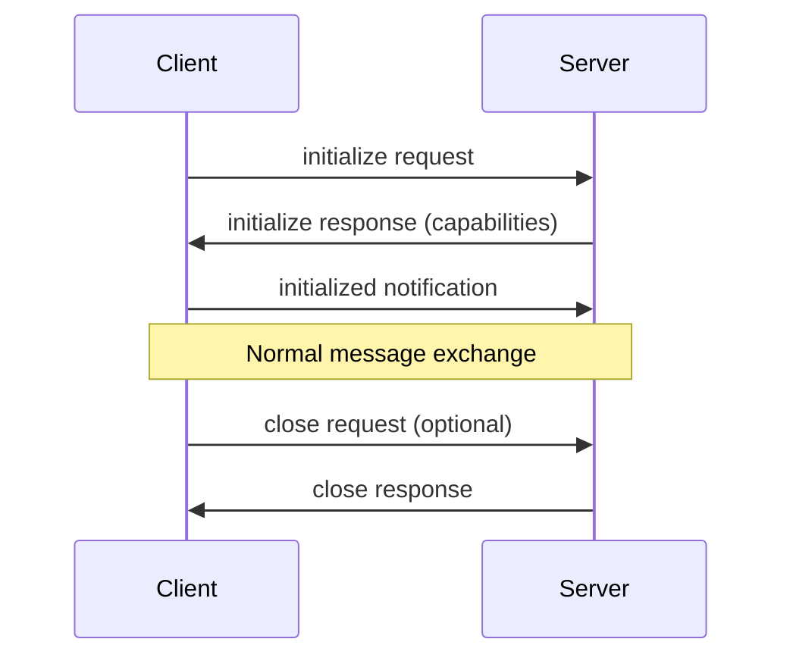

# Complete MCP Reference Guide - Everything You Need to Know

## Table of Contents
1. [What is MCP?](#what-is-mcp)
2. [Architecture Overview](#architecture-overview)
3. [Core Components](#core-components)
4. [Transport Mechanisms](#transport-mechanisms)
5. [Server Features](#server-features)
6. [Client Features](#client-features)
7. [Security Best Practices](#security-best-practices)
8. [Implementation Guide](#implementation-guide)
9. [Testing and Debugging](#testing-and-debugging)
10. [Client Applications](#client-applications)
11. [Common Patterns](#common-patterns)
12. [Troubleshooting](#troubleshooting)

## What is MCP?

The Model Context Protocol (MCP) is an open protocol that standardizes how applications provide context to LLMs. Think of it like a **USB-C port for AI applications** - just as USB-C provides a standardized way to connect devices to peripherals, MCP provides a standardized way to connect AI models to different data sources and tools.

### Key Benefits
- **Standardization**: One protocol for all integrations
- **Flexibility**: Works with any LLM or application
- **Security**: Built-in security considerations
- **Extensibility**: Easy to add new capabilities

## Architecture Overview

MCP follows a **client-host-server architecture**:

```
┌─────────────────────────────────────┐
│          Host Process               │
│  (e.g., Claude Desktop, IDE)        │
│                                     │
│  ┌─────────────┐  ┌─────────────┐  │
│  │   Client 1   │  │   Client 2   │  │
│  │             │  │             │  │
│  └──────┬──────┘  └──────┬──────┘  │
│         │                 │         │
└─────────┼─────────────────┼─────────┘
          │                 │
          ▼                 ▼
┌─────────────────┐  ┌─────────────────┐
│    Server 1     │  │    Server 2     │
│ (File System)   │  │   (Database)    │
└─────────────────┘  └─────────────────┘
```

### Key Architectural Components

1. **Hosts**: LLM applications (like Claude Desktop) that initiate connections
2. **Clients**: Connectors within the host that maintain 1:1 connections with servers
3. **Servers**: Services that provide context, tools, and prompts to clients

### Protocol Layers

1. **Protocol Layer**: Handles message framing, request/response linking
2. **Transport Layer**: Handles actual communication (stdio, HTTP/SSE, Streamable HTTP)
3. **Application Layer**: Implements resources, tools, prompts, and other features

## Core Components

### 1. JSON-RPC 2.0 Messages

MCP uses JSON-RPC 2.0 for all communication:

```typescript
// Request
{
  "jsonrpc": "2.0",
  "id": 1,
  "method": "tools/call",
  "params": {
    "name": "read_file",
    "arguments": { "path": "data.txt" }
  }
}

// Successful Response
{
  "jsonrpc": "2.0",
  "id": 1,
  "result": {
    "content": [{ "type": "text", "text": "File contents..." }]
  }
}

// Error Response
{
  "jsonrpc": "2.0",
  "id": 1,
  "error": {
    "code": -32602,
    "message": "Invalid params",
    "data": { "details": "Path not found" }
  }
}

// Notification (no ID, no response expected)
{
  "jsonrpc": "2.0",
  "method": "notifications/progress",
  "params": {
    "progressToken": "op-123",
    "progress": { "percentage": 50 }
  }
}
```

### 2. Connection Lifecycle



### 3. Error Codes

Standard JSON-RPC error codes:
- `-32700`: Parse error
- `-32600`: Invalid Request
- `-32601`: Method not found
- `-32602`: Invalid params
- `-32603`: Internal error

Custom error codes: Above `-32000`

## Transport Mechanisms

### 1. Standard Input/Output (stdio)

Best for:
- Local integrations
- Command-line tools
- Simple process communication

```typescript
// Server implementation
const transport = new StdioServerTransport();
await server.connect(transport);

// Client implementation
const transport = new StdioClientTransport({
  command: "node",
  args: ["./server.js"]
});
await client.connect(transport);
```

### 2. Streamable HTTP (NEW - Replaces SSE)

Best for:
- Remote servers
- Cloud deployments
- Bi-directional streaming

Features:
- HTTP POST for client-to-server
- Optional SSE for server-to-client
- Session management support
- Progressive message delivery

```typescript
// Server with session management
const transports = new Map();

app.post('/mcp', async (req, res) => {
  const sessionId = req.headers['mcp-session-id'];
  let transport;
  
  if (sessionId && transports.has(sessionId)) {
    transport = transports.get(sessionId);
  } else {
    transport = new StreamableHTTPServerTransport({
      sessionIdGenerator: () => crypto.randomUUID(),
      onsessioninitialized: (id) => {
        transports.set(id, transport);
      }
    });
    await server.connect(transport);
  }
  
  await transport.handleRequest(req, res, req.body);
});
```

### 3. Security Considerations for Transports

**DNS Rebinding Protection**:
```typescript
app.use((req, res, next) => {
  const origin = req.headers.origin;
  const allowedOrigins = ['http://localhost:3000', 'https://myapp.com'];
  
  if (!allowedOrigins.includes(origin)) {
    return res.status(403).json({ error: 'Forbidden' });
  }
  
  res.setHeader('Access-Control-Allow-Origin', origin);
  next();
});
```

**Bind to localhost only**:
```typescript
app.listen(3000, '127.0.0.1'); // NOT 0.0.0.0
```

## Server Features

### 1. Resources (Read-Only Data)

Resources expose data that can be read by clients:

```typescript
// Static resource
server.setRequestHandler(ListResourcesRequestSchema, async () => ({
  resources: [{
    uri: "config://app",
    name: "Application Config",
    description: "Current app configuration",
    mimeType: "application/json"
  }]
}));

// Dynamic resource with URI template
server.setRequestHandler(ListResourcesRequestSchema, async () => ({
  resources: [{
    uri: "file:///{path}",
    name: "File System",
    description: "Access files",
    mimeType: "text/plain"
  }]
}));

// Reading resources
server.setRequestHandler(ReadResourceRequestSchema, async (request) => {
  const { uri } = request.params;
  
  if (uri === "config://app") {
    return {
      contents: [{
        uri,
        mimeType: "application/json",
        text: JSON.stringify(config)
      }]
    };
  }
});
```

### 2. Tools (Executable Functions)

Tools allow LLMs to perform actions:

```typescript
// Tool with structured output (2025-06-18 feature)
const analyzeCodeTool: Tool = {
  name: "analyze_code",
  description: "Analyze code for issues",
  inputSchema: {
    type: "object",
    properties: {
      file: { type: "string" },
      type: { type: "string", enum: ["security", "performance"] }
    },
    required: ["file", "type"]
  },
  outputSchema: {
    type: "object",
    properties: {
      issues: {
        type: "array",
        items: {
          type: "object",
          properties: {
            line: { type: "number" },
            severity: { type: "string" },
            message: { type: "string" }
          }
        }
      }
    }
  }
};

// Tool handler with resource links
server.setRequestHandler(CallToolRequestSchema, async (request) => {
  const { name, arguments: args } = request.params;
  
  if (name === "create_file") {
    await fs.writeFile(args.path, args.content);
    
    return {
      content: [{
        type: "text",
        text: `Created file: ${args.path}`
      }],
      // NEW: Resource links in tool results
      resourceLinks: [{
        uri: `file://${args.path}`
      }]
    };
  }
});
```

### 3. Prompts (Reusable Templates)

Prompts provide templates for common interactions:

```typescript
server.setRequestHandler(ListPromptsRequestSchema, async () => ({
  prompts: [{
    name: "debug_error",
    description: "Debug an error with context",
    arguments: [
      {
        name: "error",
        description: "The error message",
        required: true
      },
      {
        name: "context",
        description: "Additional context",
        required: false
      }
    ]
  }]
}));

server.setRequestHandler(GetPromptRequestSchema, async (request) => {
  const { name, arguments: args } = request.params;
  
  if (name === "debug_error") {
    return {
      messages: [{
        role: "user",
        content: {
          type: "text",
          text: `Help me debug this error:\n\n${args.error}\n\nContext: ${args.context || 'None provided'}`
        }
      }]
    };
  }
});
```

## Client Features

### 1. Sampling (LLM Completions)

Allows servers to request LLM completions through the client:

```typescript
// Server requests LLM generation
const samplingRequest = {
  method: "sampling/createMessage",
  params: {
    messages: [{
      role: "user",
      content: {
        type: "text",
        text: "Generate a commit message for these changes..."
      }
    }],
    modelPreferences: {
      costPriority: 0.3,
      speedPriority: 0.5,
      intelligencePriority: 0.8,
      hints: [
        { name: "claude-3" },
        { name: "gpt-4" }
      ]
    },
    systemPrompt: "You are a helpful coding assistant.",
    includeContext: "allServers", // or "thisServer" or "none"
    metadata: {
      temperature: 0.7
    }
  }
};
```

### 2. Roots (Filesystem Boundaries)

Defines where servers can operate:

```typescript
// Client provides roots
server.setRequestHandler(ListRootsRequestSchema, async () => ({
  roots: [
    {
      uri: "file:///Users/me/projects",
      name: "Projects"
    },
    {
      uri: "file:///Users/me/documents",
      name: "Documents"
    }
  ]
}));

// Server validates operations against roots
function validatePath(requestedPath: string, roots: string[]): boolean {
  const resolved = path.resolve(requestedPath);
  return roots.some(root => resolved.startsWith(root));
}
```

### 3. Elicitation (User Input Requests)

Servers can request additional information from users:

```typescript
// Server sends elicitation request
const elicitationRequest = {
  method: "elicitation/create",
  params: {
    message: "Please provide project configuration",
    requestedSchema: {
      type: "object",
      properties: {
        name: {
          type: "string",
          description: "Project name"
        },
        type: {
          type: "string",
          enum: ["web", "api", "library"],
          description: "Project type"
        },
        private: {
          type: "boolean",
          description: "Private project?",
          default: false
        }
      },
      required: ["name", "type"]
    }
  }
};

// Handle response
switch (response.action) {
  case "accept":
    // User provided information
    const config = response.content;
    break;
  case "reject":
    // User explicitly rejected
    throw new Error("Configuration rejected");
  case "cancel":
    // User cancelled (closed dialog)
    throw new Error("Configuration cancelled");
}
```

## Security Best Practices

### 1. Path Validation

```typescript
const BLACKLISTED_PATHS = ['.git/config', '.env', 'node_modules', '.ssh'];

function validatePath(requestedPath: string, baseDir: string): string {
  const resolved = path.resolve(baseDir, requestedPath);
  
  // Prevent traversal
  if (!resolved.startsWith(baseDir)) {
    throw new Error("Path traversal detected");
  }
  
  // Check blacklist
  if (BLACKLISTED_PATHS.some(p => resolved.includes(p))) {
    throw new Error("Access to sensitive path denied");
  }
  
  return resolved;
}
```

### 2. Command Execution Safety

```typescript
const ALLOWED_COMMANDS = ['git', 'npm', 'ls', 'cat'];

function validateCommand(command: string): void {
  const baseCommand = command.split(' ')[0];
  
  if (!ALLOWED_COMMANDS.includes(baseCommand)) {
    throw new Error(`Command not allowed: ${baseCommand}`);
  }
}

// Execute with timeout
async function executeCommand(cmd: string, args: string[]) {
  validateCommand(cmd);
  
  return new Promise((resolve, reject) => {
    const proc = spawn(cmd, args, {
      timeout: 30000, // 30 second timeout
      maxBuffer: 1024 * 1024 // 1MB output limit
    });
    
    // Handle output...
  });
}
```

### 3. OAuth Implementation (2025-06-18)

```typescript
// Declare as OAuth resource server
const server = new Server(
  {
    name: "secure-server",
    version: "1.0.0",
    protectedResources: [{
      uri: "https://api.example.com/mcp",
      bearerTokenRequired: true
    }]
  },
  {
    capabilities: {
      auth: {
        oauth2: {
          authorizationUrl: "https://auth.example.com/oauth/authorize",
          tokenUrl: "https://auth.example.com/oauth/token",
          scopes: {
            "read:data": "Read access",
            "write:data": "Write access"
          }
        }
      }
    }
  }
);

// Validate with RFC 8707 resource indicators
async function validateToken(token: string, resource: string) {
  const response = await fetch("https://auth.example.com/introspect", {
    method: "POST",
    headers: {
      "Authorization": `Bearer ${serverToken}`,
      "Content-Type": "application/x-www-form-urlencoded"
    },
    body: new URLSearchParams({
      token,
      resource // RFC 8707 resource indicator
    })
  });
  
  const result = await response.json();
  if (!result.active) {
    throw new Error("Invalid token");
  }
  
  return result;
}
```

### 4. Elicitation Safety

```typescript
// Never request sensitive information
const FORBIDDEN_FIELDS = ['password', 'ssn', 'creditCard', 'apiKey'];

function validateElicitationSchema(schema: any) {
  const schemaStr = JSON.stringify(schema).toLowerCase();
  
  for (const forbidden of FORBIDDEN_FIELDS) {
    if (schemaStr.includes(forbidden.toLowerCase())) {
      throw new Error(`Cannot request sensitive field: ${forbidden}`);
    }
  }
}
```

## Implementation Guide

### 1. Minimal Server Example

```typescript
#!/usr/bin/env node

import { Server } from "@modelcontextprotocol/sdk/server/index.js";
import { StdioServerTransport } from "@modelcontextprotocol/sdk/server/stdio.js";
import {
  CallToolRequestSchema,
  ListToolsRequestSchema,
} from "@modelcontextprotocol/sdk/types.js";

// Create server
const server = new Server(
  {
    name: "minimal-server",
    version: "1.0.0",
  },
  {
    capabilities: {
      tools: {},
    },
  }
);

// Define tools
server.setRequestHandler(ListToolsRequestSchema, async () => ({
  tools: [{
    name: "hello",
    description: "Say hello",
    inputSchema: {
      type: "object",
      properties: {
        name: { type: "string" }
      },
      required: ["name"]
    }
  }]
}));

// Handle tool calls
server.setRequestHandler(CallToolRequestSchema, async (request) => {
  if (request.params.name === "hello") {
    return {
      content: [{
        type: "text",
        text: `Hello, ${request.params.arguments.name}!`
      }]
    };
  }
  throw new Error("Tool not found");
});

// Start server
const transport = new StdioServerTransport();
await server.connect(transport);
console.error("Server running on stdio");
```

### 2. Package.json Configuration

```json
{
  "name": "my-mcp-server",
  "version": "1.0.0",
  "type": "module",
  "bin": {
    "my-server": "./build/index.js"
  },
  "scripts": {
    "build": "tsc",
    "watch": "tsc --watch",
    "test": "npx @modelcontextprotocol/inspector node build/index.js"
  },
  "dependencies": {
    "@modelcontextprotocol/sdk": "^1.13.2",
    "zod": "^3.22.0"
  },
  "devDependencies": {
    "@types/node": "^20.10.0",
    "typescript": "^5.3.0",
    "@modelcontextprotocol/inspector": "^0.2.0"
  }
}
```

### 3. TypeScript Configuration

```json
{
  "compilerOptions": {
    "target": "ES2022",
    "module": "NodeNext",
    "moduleResolution": "NodeNext",
    "esModuleInterop": true,
    "strict": true,
    "skipLibCheck": true,
    "outDir": "./build",
    "rootDir": "./src"
  },
  "include": ["src/**/*"],
  "exclude": ["node_modules", "build"]
}
```

### 4. Claude Desktop Configuration

```json
{
  "mcpServers": {
    "my-server": {
      "command": "node",
      "args": ["/absolute/path/to/build/index.js"],
      "env": {
        "NODE_ENV": "production",
        "PROJECT_ROOT": "/path/to/project"
      }
    }
  }
}
```

Location:
- macOS: `~/Library/Application Support/Claude/claude_desktop_config.json`
- Windows: `%APPDATA%\Claude\claude_desktop_config.json`

## Testing and Debugging

### 1. MCP Inspector

```bash
# Test your server interactively
npx @modelcontextprotocol/inspector node build/index.js

# Test with specific features
npx @modelcontextprotocol/inspector \
  --test-sampling \
  --test-elicitation \
  --roots /test/dir \
  node build/index.js
```

### 2. Debugging Claude Desktop

Check logs:
```bash
# macOS
tail -f ~/Library/Logs/Claude/mcp-server-*.log

# Windows (PowerShell)
Get-Content "$env:APPDATA\Claude\logs\mcp-server-*.log" -Tail 20 -Wait
```

### 3. Manual Testing

Test server manually:
```bash
# Start server
node build/index.js

# In another terminal, send JSON-RPC
echo '{"jsonrpc":"2.0","id":1,"method":"tools/list","params":{}}' | node build/index.js
```

### 4. Unit Testing

```typescript
import { Server } from "@modelcontextprotocol/sdk/server/index.js";
import { MemoryTransport } from "@modelcontextprotocol/sdk/testing";

describe("MCP Server", () => {
  let server: Server;
  let transport: MemoryTransport;

  beforeEach(async () => {
    server = new Server({ name: "test", version: "1.0.0" });
    transport = new MemoryTransport();
    await server.connect(transport);
  });

  it("should list tools", async () => {
    const response = await transport.sendRequest({
      jsonrpc: "2.0",
      id: 1,
      method: "tools/list",
      params: {}
    });
    
    expect(response.result.tools).toHaveLength(1);
  });
});
```

## Client Applications

### Official Clients
1. **Claude Desktop** - Anthropic's desktop app with MCP support
2. **Continue** - VS Code extension for AI pair programming
3. **Cline** - Autonomous coding agent with MCP integration

### Community Clients
1. **Tome** - Cross-platform desktop app for local LLMs
2. **TypingMind** - Advanced LLM frontend with MCP support
3. **Zed** - Code editor with MCP integration
4. **MCPHub** - Neovim plugin for MCP
5. **Superjoin** - Google Sheets extension with MCP

### Building Your Own Client

```typescript
import { Client } from "@modelcontextprotocol/sdk/client/index.js";
import { StdioClientTransport } from "@modelcontextprotocol/sdk/client/stdio.js";

// Create client
const client = new Client(
  {
    name: "my-client",
    version: "1.0.0"
  },
  {
    capabilities: {
      sampling: {},
      roots: {
        listChanged: true
      }
    }
  }
);

// Connect to server
const transport = new StdioClientTransport({
  command: "node",
  args: ["./server.js"]
});

await client.connect(transport);

// Use server capabilities
const tools = await client.listTools();
const result = await client.callTool({
  name: "read_file",
  arguments: { path: "data.txt" }
});
```

## Common Patterns

### 1. Progress Reporting

```typescript
server.setRequestHandler(CallToolRequestSchema, async (request, extra) => {
  const { progressToken } = extra;
  
  if (progressToken) {
    // Report progress
    await server.sendProgress({
      progressToken,
      progress: {
        kind: "begin",
        title: "Processing..."
      }
    });
    
    // Do work...
    
    await server.sendProgress({
      progressToken,
      progress: {
        kind: "report",
        percentage: 50,
        message: "Halfway done"
      }
    });
    
    // More work...
    
    await server.sendProgress({
      progressToken,
      progress: {
        kind: "end"
      }
    });
  }
});
```

### 2. Cancellation Handling

```typescript
server.setRequestHandler(CallToolRequestSchema, async (request, extra) => {
  const { cancellationToken } = extra;
  
  for (const item of items) {
    // Check cancellation
    if (cancellationToken?.isCancellationRequested) {
      throw new Error("Operation cancelled");
    }
    
    await processItem(item);
  }
});
```

### 3. Resource Subscriptions

```typescript
// Server notifies when resources change
server.sendNotification({
  method: "notifications/resources/changed",
  params: {
    uri: "config://app"
  }
});

// Client can subscribe to updates
client.on("notifications/resources/changed", (params) => {
  console.log(`Resource changed: ${params.uri}`);
});
```

### 4. Dynamic Capabilities

```typescript
class DynamicServer {
  private tools = new Map<string, Tool>();
  
  async addTool(tool: Tool) {
    this.tools.set(tool.name, tool);
    
    // Notify clients of change
    await this.server.sendNotification({
      method: "notifications/tools/listChanged"
    });
  }
  
  async removeTool(name: string) {
    this.tools.delete(name);
    
    await this.server.sendNotification({
      method: "notifications/tools/listChanged"
    });
  }
}
```

## Troubleshooting

### Common Issues

1. **Server not detected in Claude Desktop**
   - Check logs: `~/Library/Logs/Claude/mcp-server-*.log`
   - Verify absolute paths in config
   - Ensure executable permissions
   - Restart Claude Desktop

2. **"Command not found" errors**
   - Install Node.js/Python/etc.
   - Use full paths in config
   - Check PATH environment variable

3. **Connection timeouts**
   - Increase initialization timeout
   - Check server startup time
   - Verify no errors in server code

4. **Permission denied**
   - Check file permissions
   - Verify paths are correct
   - Run with appropriate user

### Debug Commands

```bash
# Test server manually
node /path/to/server.js

# Check if npx works
npx -y @modelcontextprotocol/server-filesystem

# Verify config syntax
python -m json.tool < ~/Library/Application\ Support/Claude/claude_desktop_config.json

# Watch logs
tail -f ~/Library/Logs/Claude/mcp-server-*.log
```

### Environment Variables

Common issues with environment variables:

```json
{
  "my-server": {
    "command": "node",
    "args": ["server.js"],
    "env": {
      // Windows: May need expanded paths
      "APPDATA": "C:\\Users\\user\\AppData\\Roaming",
      // All platforms: Use absolute paths
      "PROJECT_ROOT": "/absolute/path/to/project",
      // Pass through system env vars if needed
      "PATH": "${PATH}"
    }
  }
}
```

## Conclusion

MCP provides a powerful, standardized way to extend LLM capabilities. By following this guide, you can:

- Build secure, feature-rich MCP servers
- Integrate with various client applications
- Implement advanced features like elicitation and sampling
- Debug and troubleshoot effectively
- Follow security best practices

Remember:
- Start simple, add features incrementally
- Always validate inputs and paths
- Test thoroughly with the MCP Inspector
- Follow security best practices
- Join the community for support and updates

For the latest updates and community resources:
- [Official Documentation](https://modelcontextprotocol.io)
- [GitHub Repository](https://github.com/modelcontextprotocol)
- [Community Servers](https://github.com/modelcontextprotocol/servers)
- [Discord Community](https://discord.gg/modelcontextprotocol)